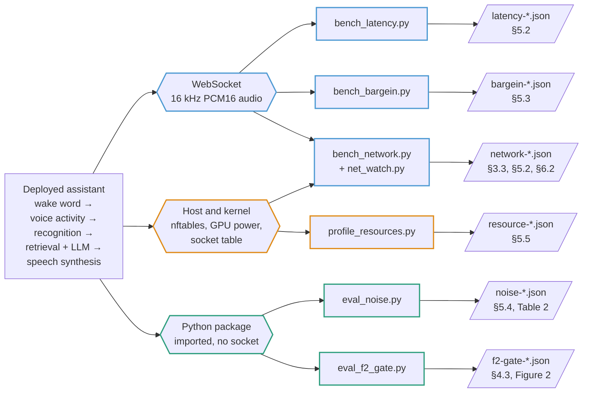

# onprem-speech-assistant-measurements

Measurement probes and raw result files for *Nothing Leaves the Room: Measuring
a Fully On-Premises Speech Assistant and Its Failure Modes*, IADIS Applied
Computing 2026. The assistant itself is not part of this repository.

## Layout

    probes/          measurement scripts
    data/queries/    20 German query texts and the script that speaks them
    data/noise/      checksum manifest for the noise corpus
    results/         one raw JSON file per run
    RESULTS.md       every number in the paper, mapped to its file and command

## Quick start

```bash
pip install -r requirements.txt

# The timing probes read query audio, which is not redistributed. Generate it
# once with a Piper voice of your own:
python data/queries/make_eval_audio.py --model <voice>.onnx

python probes/bench_latency.py --runs 3
python probes/bench_bargein.py --runs 30
python probes/bench_network.py --mode online --lan 10.0.0.0/8   # needs Docker and root
```

`--url` sets the assistant's endpoint, default `wss://127.0.0.1:8765/speech`.
`--lan` is the subnet that counts as on site.

## The harness



Each probe reaches the assistant through one of three interfaces and leaves one
kind of result file. Read a row left to right to see how a number was taken:
which interface, which script, which file in `results/`. Section, table and
figure numbers refer to the camera-ready as published.

`data/queries/prompts.jsonl` supplies the texts that `make_eval_audio.py` speaks
into the audio the WebSocket probes stream; `fetch_noise.py` supplies the corpus
that `eval_noise.py` mixes.

## Probes

| Script | Measures | Needs |
|---|---|---|
| `bench_latency.py` | end of speech to first reply audio, by stage | a running assistant on a WebSocket |
| `bench_bargein.py` | interruption onset to cancellation | the same |
| `bench_network.py` | what the assistant sends beyond the site, while it serves turns | the same, plus the container name and root |
| `net_watch.py` | socket sampler that `bench_network.py` runs inside the container | runs there, not here |
| `sandbox_egress.sh` | nftables rule that drops and counts off-site traffic from the assistant's cgroup | root |
| `eval_noise.py` | word error rate against noise at fixed SNR | the assistant's Python package |
| `eval_f2_gate.py` | noise-only windows surviving each layer of the phantom-turn filter | the same |
| `profile_resources.py` | GPU power and energy per query | a running assistant and `nvidia-smi` |
| `fetch_noise.py` | fetches the noise corpus; `--verify` checks it against the manifest, without it the manifest is rewritten | network access, once |
| `eval_common.py` | word error rate helper | nothing |
| `deployment.py` | binds the two offline probes to a deployment's components | see its docstring |

`eval_noise.py` and `eval_f2_gate.py` load a deployment's own recognizer and
detectors, so they run on the deployment rather than from a clone;
`probes/deployment.py` is the single place that binds them and documents the
five roles they need. The timing and network probes work against any deployment
exposing the same WebSocket protocol.

### Network confinement

`bench_network.py --mode sandbox` runs the timing probes while an nftables rule
matched to the assistant's cgroup drops and counts everything it sends to an
address outside the site. The host keeps its own network, so the result is about
the assistant rather than the machine.

```bash
sudo probes/sandbox_egress.sh observe    # count only
sudo probes/sandbox_egress.sh run        # arm, measure, record
sudo probes/sandbox_egress.sh off        # remove
```

There is also `--mode offline`, which refuses to start until the operator has
removed every route off the host. This script never changes routing itself.

## Reading the results

`RESULTS.md` maps each printed number to its file and the command that
regenerates it. A result file carries the measured values, the run parameters,
and the environment the run saw.

Two things to know before comparing against your own runs:

- **Query audio is synthetic.** `prompts.jsonl` holds the texts; the audio is
  not redistributed, because the Piper voice carries its own licence.
  Regenerating gives the same content and a different waveform, so timing is
  comparable and word error rates are not identical.
- **Some fields are templated.** Host network topology in `network-*.json`, the
  serviced machine's model designation, manufacturer and firmware names the
  recognizer produced, and event types specific to this deployment are replaced
  by placeholders such as `<redacted>`, `<Modell>` and `other`. Counts are
  preserved wherever the count is the measured fact. No measured value, timing
  or rate is affected. `RESULTS.md` lists every substitution.

Transcripts in `noise-*.json` and `f2-gate-*.json` are otherwise published as
recognized, including the text the recognizer produced from pure noise, which is
one of the paper's findings.

## Data

| What | Where | Licence |
|---|---|---|
| Query texts | `data/queries/prompts.jsonl` | CC BY 4.0 |
| Query audio | not redistributed, regenerate with `make_eval_audio.py` | Piper voice licence |
| Noise corpus | not redistributed, fetch with `fetch_noise.py` | MS-SNSD licence |
| Noise checksums | `data/noise/noise_manifest.json` | CC BY 4.0 |
| Result files | `results/` | CC BY 4.0 |

Not included: the assistant, the documentation corpus it answers from, the
deployment configuration, the site's network detail, and the identity of the
machine the assistant serves.

## Citation

Cite the paper for the findings, and this repository as well if you reuse the
probes.

> Siddiqui, M. K., Kressel, J., Cenk, G., & May, G. (2026). Nothing leaves the
> room: Measuring a fully on-premises speech assistant and its failure modes. In
> P. Miranda & P. Isaías (Eds.), *Proceedings of the 23rd International
> Conference on Applied Computing (AC 2026)*. IADIS Press.

> Siddiqui, M. K., Kressel, J., Cenk, G., & May, G. (2026). *Probe suite and
> measurements for a fully on-premises speech assistant* (Version 1.0.0)
> [Software]. Neu-Ulm University of Applied Sciences (HNU), Technology Transfer
> Center Smart Production and Logistics.
> https://github.com/ttz-leipheim/onprem-speech-assistant-measurements

`CITATION.cff` carries the machine-readable form. The volume ISBN, the paper's
DOI and its page range are filled in on publication.

## Acknowledgement

This work arose from a project initiated and led by Prof. Dr. Jürgen Grinninger.
The Technology Transfer Center Smart Production and Logistics at Leipheim is
funded by the Free State of Bavaria.

## Licence

MIT for `probes/` and `data/queries/make_eval_audio.py` (`LICENSE`).
CC BY 4.0 for the result files, query texts and manifest (`LICENSE-DATA`).
The noise corpus keeps its own licence and is not included.
